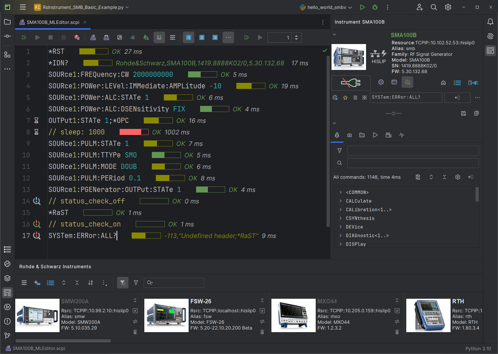

# Welcome to the RsInstrument Python Step-by-step Guide

> Source: https://rsinstrument.readthedocs.io/en/latest/StepByStepGuide.html

# Welcome to the RsInstrument Python Step-by-step Guide[](#welcome-to-the-rsinstrument-python-step-by-step-guide "Link to this heading")

# Introduction[](#introduction "Link to this heading")


RsInstrument is a Python remote-control communication module for Rohde & Schwarz SCPI-based Test and Measurement Instruments. After reading this guide you will be convinced of its edge over other remote-control packages.

The original title of this document was **“10 Tips and Tricks…”**, but there were just too many neat features to fit into 10 chapters. Some of the RsInstrument’s key features:

* Type-safe API using typing module
* You can select which VISA to use or even not use any VISA at all
* Initialization of a new session is straight-forward, no need to set any other properties
* Many useful features are already implemented - reset, self-test, opc-synchronization, error checking, option checking
* Binary data blocks transfer in both directions
* Transfer of arrays of numbers in binary or ASCII format
* File transfers in both directions
* Events generation in case of error, sent data, received data, chunk data
* Multithreading session locking - you can use multiple threads talking to one instrument at the same time
* Logging feature tailored for SCPI communication

Check out RsInstrument script examples here: [Rohde & Schwarz GitHub Repository](https://github.com/Rohde-Schwarz/Examples/tree/main).

Short Getting-started video from our Oscilloscope guys:

Oh, one other thing - for Pycharm users we just released a Remote-control Plugin that makes your Pycharm development of remote-control script much faster:

[](https://rsicpycharmplugin.readthedocs.io)

# Installation[](#installation "Link to this heading")

RsInstrument is hosted on [pypi.org](https://pypi.org/search/?q=rsinstrument). You can install it with pip (for example `pip.exe` for Windows), or if you are using Pycharm (and you should be :-) direct in the Pycharm packet management GUI.

## Option 1 - Installing with pip.exe under Windows[](#option-1-installing-with-pip-exe-under-windows "Link to this heading")

* Start the command console: `WinKey + R`, type `cmd` and hit ENTER
* Change the working directory to the Python installation of your choice (adjust the user name and python version in the path):

  > `cd c:\Users\John\AppData\Local\Programs\Python\Python310\Scripts`
* install RsInstrument with the command: `pip install RsInstrument`

## Option 2 - Installing in Pycharm[](#option-2-installing-in-pycharm "Link to this heading")

* In Pycharm Menu `File->Settings->Project->Python Interpreter` click on the **‘+’** button on the top left. Newer Pycharm versions have `Python Packages` Tool Window, you can perform the same operation there.
* Type `rsinstrument` in the search box
* Install the version 1.53.0 or newer
* If you are behind a Proxy server, configure it in the Menu: `File->Settings->Appearance->System Settings->HTTP Proxy`

For more information about Rohde & Schwarz instrument remote control, check out our Instrument remote control series:
[Rohde&Schwarz remote control Web series](https://www.rohde-schwarz.com/driver-pages/remote-control/drivers-remote-control_110753.html)

## Option 3 - Offline installation[](#option-3-offline-installation "Link to this heading")

If you are reading this, it is probably because none of the above worked for you - proxy problems, your boss saw the internet bill…
Here are 5 easy steps for installing RsInstrument offline:

* Download this python script (**Save target as**): [rsinstrument\_offline\_install.py](https://cdn.rohde-schwarz.com/pws/service_support/driver_pagedq/files_1/helloworld/rsinstrument_offline_install.py)
* Execute the script in your offline computer (supported is python 3.6 or newer)
* That’s it …
* Just watch the installation …
* Enjoy …

# Finding available instruments[](#finding-available-instruments "Link to this heading")

Similar to the pyvisa’s ResourceManager, RsInstrument can search for available instruments:

```python
1""""
2Find the instruments in your environment.
3"""
4
5from RsInstrument import *
6
7# Use the instr_list string items as resource names in the RsInstrument constructor
8instr_list = RsInstrument.list_resources("?*")
9print(instr_list)
```

If you have more VISAs installed, the one actually used by default is defined by a secret widget called VISA Conflict Manager. You can force your program to use a VISA of your choice:

```python
 1"""
 2Find the instruments in your environment with the defined VISA implementation.
 3"""
 4
 5from RsInstrument import *
 6
 7# In the optional parameter visa_select you can use e.g.: 'rs' or 'ni'
 8# Rs Visa also finds any NRP-Zxx USB sensors
 9instr_list = RsInstrument.list_resources('?*', 'rs')
10print(instr_list)
```

Tip

We believe our R&S VISA is the best choice for our customers. Couple of reasons why:

* Small footprint
* Superior VXI-11 and HiSLIP performance
* Integrated legacy sensors NRP-Zxx support
* Additional VXI-11 and LXI devices search
* Available for Windows, Linux, Mac OS

# Initiating instrument session[](#initiating-instrument-session "Link to this heading")

RsInstrument offers four different types of starting your remote-control session. We begin with the most typical case, and progress with more special ones.

## Standard Session Initialization[](#standard-session-initialization "Link to this heading")

Initiating new instrument session happens, when you instantiate the RsInstrument object. Below, is a Hello World example. Different resource names are examples for different physical interfaces.

```python
 1"""
 2Basic example on how to use the RsInstrument module for remote-controlling your VISA instrument.
 3Preconditions:
 4    - Installed RsInstrument Python module Version 1.50.0 or newer from pypi.org.
 5    - Installed VISA e.g. R&S Visa 5.12 or newer.
 6"""
 7
 8from RsInstrument import *
 9
10# A good practice is to assure that you have a certain minimum version installed
11RsInstrument.assert_minimum_version('1.102.0')
12resource_string_1 = 'TCPIP::192.168.2.101::INSTR'  # Standard LAN connection (also called VXI-11)
13resource_string_2 = 'TCPIP::192.168.2.101::hislip0'  # Hi-Speed LAN connection - see 1MA208
14resource_string_3 = 'GPIB::20::INSTR'  # GPIB Connection
15resource_string_4 = 'USB::0x0AAD::0x0119::022019943::INSTR'  # USB-TMC (Test and Measurement Class)
16resource_string_5 = 'RSNRP::0x0095::104015::INSTR'  # R&S Powersensor NRP-Z86
17
18# Initializing the session
19instr = RsInstrument(resource_string_1)
20
21idn = instr.query_str('*IDN?')
22print(f"\nHello, I am: '{idn}'")
23print(f'RsInstrument driver version: {instr.driver_version}')
24print(f'Visa manufacturer: {instr.visa_manufacturer}')
25print(f'Instrument full name: {instr.full_instrument_model_name}')
26print(f'Instrument installed options: {",".join(instr.instrument_options)}')
27
28# Close the session
29instr.close()
```

Note

If you are wondering about the `ASRL1::INSTR` - yes, it works too, but come on… it’s 2024 :-)

Do not care about specialty of each session kind; RsInstrument handles all the necessary session settings for you. You have immediately access to many identification properties. Here are same of them:

```python
idn_string: str
driver_version: str
visa_manufacturer: str
full_instrument_model_name: str
instrument_serial_number: str
instrument_firmware_version: str
instrument_options: List[str]
```

The constructor also contains optional boolean arguments `id_query` and `reset`:

```python
instr = RsInstrument('TCPIP::192.168.56.101::hislip0', id_query=True, reset=True)
```

* Setting `id_query` to True (default is True) checks, whether your instrument can be used with the RsInstrument module.
* Setting `reset` to True (default is False) resets your instrument. It is equivalent to calling the `reset()` method.

If you tend to forget closing the session, use the context-manager. The session is closed even if the block inside `with` raises an exception:

```python
 1"""
 2Using Context-Manager for you RsInstrument session.
 3No matter what happens inside the 'with' section, your session is always closed properly.
 4"""
 5
 6from RsInstrument import *
 7
 8RsInstrument.assert_minimum_version('1.102.0')
 9with RsInstrument('TCPIP::192.168.2.101::hislip0') as instr:
10    idn = instr.query('*IDN?')
11    print(f"\nHello, I am: '{idn}'")
12
```

## Selecting specific VISA[](#selecting-specific-visa "Link to this heading")

Same as for the `list_resources()` function , RsInstrument allows you to choose which VISA to use:

```python
 1"""
 2Choosing VISA implementation.
 3"""
 4
 5from RsInstrument import *
 6
 7# Force use of the Rs Visa. For e.g.: NI Visa, use the "SelectVisa='ni'"
 8instr = RsInstrument('TCPIP::192.168.56.101::INSTR', True, True, "SelectVisa='rs'")
 9
10idn = instr.query_str('*IDN?')
11print(f"\nHello, I am: '{idn}'")
12print(f"\nI am using the VISA from: {instr.visa_manufacturer}")
13
14# Close the session
15instr.close()
```

## No VISA Session[](#no-visa-session "Link to this heading")

We recommend using VISA whenever possible, preferably with HiSLIP session because of its low latency.
However, if you are a strict VISA-refuser, RsInstrument has something for you too:

**No VISA raw LAN socket**:

```python
 1"""
 2Using RsInstrument without VISA for LAN Raw socket communication.
 3"""
 4
 5from RsInstrument import *
 6
 7instr = RsInstrument('TCPIP::192.168.56.101::5025::SOCKET', True, True, "SelectVisa='socket'")
 8print(f'Visa manufacturer: {instr.visa_manufacturer}')
 9print(f"\nHello, I am: '{instr.idn_string}'")
10print(f"\nNo VISA has been harmed or even used in this example.")
11
12# Close the session
13instr.close()
```

Warning

Not using VISA can cause problems by debugging when you want to use the communication Trace Tool. The good news is, you can easily switch to use VISA and back just by changing the constructor arguments. The rest of your code stays unchanged.

## Simulating Session[](#simulating-session "Link to this heading")

If a colleague is currently occupying your instrument, leave him in peace, and open a simulating session:

```python
instr = RsInstrument('TCPIP::192.168.56.101::hislip0', True, True, "Simulate=True")
```

More `option_string` tokens are separated by comma:

```python
instr = RsInstrument('TCPIP::192.168.56.101::hislip0', True, True, "SelectVisa='rs', Simulate=True")
```

Note

Simulating session works as a database - when you write a command **SENSe:FREQ 10MHz**, the query **SENSe:FREQ?** returns **10MHz** back. For queries not preceded by set commands, the RsInstrument returns default values:

* **‘Simulating’** for string queries.
* **0** for integer queries.
* **0.0** for float queries.
* **False** for boolean queries.

## Shared Session[](#shared-session "Link to this heading")

In some scenarios, you want to have two independent objects talking to the same instrument. Rather than opening a second VISA connection, share the same one between two or more RsInstrument objects:

```python
 1"""
 2Sharing the same physical VISA session by two different RsInstrument objects.
 3"""
 4
 5from RsInstrument import *
 6
 7instr1 = RsInstrument('TCPIP::192.168.56.101::INSTR', True, True)
 8instr2 = RsInstrument.from_existing_session(instr1)
 9
10print(f'instr1: {instr1.idn_string}')
11print(f'instr2: {instr2.idn_string}')
12
13# Closing the instr2 session does not close the instr1 session - instr1 is the 'session master'
14instr2.close()
15print(f'instr2: I am closed now')
16
17print(f'instr1: I am  still opened and working: {instr1.idn_string}')
18instr1.close()
19print(f'instr1: Only now I am closed.')
```

Note

The `instr1` is the object holding the ‘master’ session. If you call the `instr1.close()`, the `instr2` loses its instrument session as well, and becomes pretty much useless.

# Checking the installed options[](#checking-the-installed-options "Link to this heading")

If your instrument refuses to execute desired actions, and you do not know why - after all, the SCPI commands are in the User Manual, it’s worth to check if the a special option is required.
RsInstrument provides several ways to do it. The following example shows the literal CASE-INSENSITIVE searching:

```python
 1"""
 2Checking the installed options with literal search.
 3"""
 4
 5from RsInstrument import *
 6
 7instr = RsInstrument('TCPIP::192.168.56.101::hislip0')
 8
 9# Get all the options as list, and check for the specific one.
10if 'K1' in instr.instrument_options:
11	print('Option K1 installed')
12
13# Check for one option.
14# Keep in mind, that if the 'K0' is present, all the K-options are reported as installed.
15if instr.has_instr_option('K1'):
16	print('Option K1 installed')
17	
18# Check whether the K0 is installed:
19if instr.has_instr_option_k0():
20	print('You are a lucky customer, your instrument has all the K-options available.')
21	
22# Check with a dedicated function for at least one option (logical OR).
23if instr.has_instr_option('K1 / K1a / K1b'):
24	print('At least one of the K1,K1a,K1b installed')
25
26# Same as previous, but entered as a list of strings.
27if instr.has_instr_option(['K1', 'K1a', 'K1b']):
28	print('At least one of the K1,K1a,K1b installed')
29
30instr.close()
```

Note

`instr.instrument_options` returns neatly sorted list of options, where the duplicates are removed, K-options are at the beginning, and the B-options at the end.

If for any reason you want to see how many times the K101 option was in the original Option’s string, use the `io.get_option_counts('K101')`

Regular expressions CASE-INSENSITIVE searching. The Regex must be fully matched. That means, for example, `K1.` only positively matches `K10` or `K17`, but not `K1` or `K110`

```python
 1"""
 2Checking the installed options with regular expressions search.
 3"""
 4
 5from RsInstrument import *
 6
 7instr = RsInstrument('TCPIP::192.168.56.101::hislip0')
 8
 9# Check for one option.
10# Keep in mind, that if the 'K0' is present, all the K-options are reported as installed.
11if instr.has_instr_option_regex('K1.'):
12    print('Option K10 or K11 or K12 up to K19 installed')
13
14# Check with a dedicated function for at least one option (logical OR).
15if instr.has_instr_option_regex('K1. / K2..'):
16    print('At least one of the K10..K19, K200..K299 installed')
17
18# Same as previous, but entered as a list of strings.
19if instr.has_instr_option_regex(['K1.', 'K2..']):
20    print('At least one of the K10..K19, K200..K299 installed')
21
22instr.close()
```

If you wish to add or remove reported options, you can use `add_instr_option()` or `remove_instr_option()`. The `instr.instrument_options` is re-sorted after each change in the list:

```python
 1"""
 2Changing how the installed options are reported.
 3This code does not actually install any option on the instrument :-)
 4"""
 5
 6from RsInstrument import *
 7
 8instr = RsInstrument('TCPIP::192.168.56.101::hislip0')
 9
10# I want to remove the 'K0' and see if the individual K-options are reported as present.
11instr.remove_instr_option('K0')
12if not instr.has_instr_option_k0():
13    print('We have lost the K0, let us hope the individual options are still reported.')
14
15instr.add_instr_option('K0')
16if not instr.has_instr_option_k0():
17    print('Now we have the K0 again :-)')
```

Note

It would be nice to install an instrument option with this small python script. Unfortunately, this is not the case - the script just manipulates the reported list of options. If you want to install an option on your instrument, you will have to buy it :-)

# Basic I/O communication[](#basic-i-o-communication "Link to this heading")

Now we have opened the session, it’s time to do some work. RsInstrument provides two basic methods for communication:

* `write()` - writing a command without an answer e.g.: **\*RST**
* `query()` - querying your instrument, for example with the **\*IDN?** query

Here, you may ask a question: Where is the `read()` ?
Short answer - you do not need it. Long answer - your instrument never sends unsolicited responses. If you send a set-command, you use `write()`. For a query-command, you use `query()`. So, you really do not need it…

Enough with the theory, let us look at an example. Basic write, and query:

```python
 1"""
 2Basic string write_str / query_str.
 3"""
 4
 5from RsInstrument import *
 6
 7instr = RsInstrument('TCPIP::192.168.56.101::INSTR', True, True)
 8instr.write_str('*RST')
 9response = instr.query_str('*IDN?')
10print(response)
11
12# Close the session
13instr.close()
```

This example is so-called “*University-Professor-Example*” - good to show a principle, but never used in praxis. The previously mentioned commands are already a part of the driver’s API. Here is another example, achieving the same goal:

```python
 1"""
 2Basic string write_str / query_str.
 3"""
 4
 5from RsInstrument import *
 6
 7instr = RsInstrument('TCPIP::192.168.56.101::INSTR', True, True)
 8instr.reset()
 9print(instr.idn_string)
10
11# Close the session
12instr.close()
```

One additional feature we need to mention here: **VISA timeout**. To simplify, VISA timeout plays a role in each `query_xxx()`, where the controller (your PC) has to prevent waiting forever for an answer from your instrument. VISA timeout defines that maximum waiting time. You can set/read it with the `visa_timeout` property:

```python
# Timeout in milliseconds
instr.visa_timeout = 3000
```

After this time, RsInstrument raises an exception. Speaking of exceptions, an important feature of the RsInstrument is **Instrument Status Checking**. Check out the next chapter that describes the error checking in details.

For completion, we mention other string-based `write_xxx()` and `query_xxx()` methods, all in one example. They are convenient extensions providing type-safe float/boolean/integer setting/querying features:

```python
 1"""
 2Basic string write_xxx / query_xxx.
 3"""
 4
 5from RsInstrument import *
 6
 7instr = RsInstrument('TCPIP::192.168.56.101::INSTR', True, True)
 8instr.visa_timeout = 5000
 9instr.instrument_status_checking = True
10instr.write_int('SWEEP:COUNT ', 10)  # sending 'SWEEP:COUNT 10'
11instr.write_bool('SOURCE:RF:OUTPUT:STATE ', True)  # sending 'SOURCE:RF:OUTPUT:STATE ON'
12instr.write_float('SOURCE:RF:FREQUENCY ', 1E9)  # sending 'SOURCE:RF:FREQUENCY 1000000000'
13
14sc = instr.query_int('SWEEP:COUNT?')  # returning integer number sc=10
15out = instr.query_bool('SOURCE:RF:OUTPUT:STATE?')  # returning boolean out=True
16freq = instr.query_float('SOURCE:RF:FREQUENCY?')  # returning float number freq=1E9
17
18# Close the session
19instr.close()
```

Lastly, a method providing basic synchronization: `query_opc()`. It sends **\*OPC?** to your instrument. The instrument waits with the answer until all the tasks it currently has in the execution queue are finished. This way your program waits too, and it is synchronized with actions in the instrument. Remember to have the VISA timeout set to an appropriate value to prevent the timeout exception. Here’s a snippet:

```python
instr.visa_timeout = 3000
instr.write("INIT")
instr.query_opc()

# The results are ready now to fetch
results = instr.query('FETCH:MEASUREMENT?')
```

You can define the VISA timeout directly in the `query_opc`, which is valid only for that call. Afterwards, the VISA timeout is set to the previous value:

```python
instr.write("INIT")
instr.query_opc(3000)
```

Tip

Wait, there’s more: you can send the **\*OPC?** after each `write_xxx()` automatically:

```python
# Default value after init is False
instr.opc_query_after_write = True
```

# Error Checking[](#error-checking "Link to this heading")

RsInstrument has a built-in mechanism that after each command/query checks the instrument’s status subsystem, and raises an exception if it detects an error. For those who are already screaming: **Speed Performance Penalty!!!**, don’t worry, you can disable it.

Instrument status checking is very useful since in case your command/query caused an error, you are immediately informed about it. Status checking has in most cases no practical effect on the speed performance of your program. However, if for example, you do many repetitions of short write/query sequences, it might make a difference to switch it off:

```python
# Default value after init is True
instr.instrument_status_checking = False
```

To clear the instrument status subsystem of all errors, call this method:

```python
# Clear all the errors in the error queue
    instr.clear_status()
```

Instrument’s status system error queue is clear-on-read. It means, if you query its content, you clear it at the same time. To query and clear list of all the current errors, use the following:

```python
# Query all the errors in the error queue
    errors_list = instr.query_all_errors()
```

You can also check + clear the errors and raise exception if some errors occured:

```python
# Check for errors and raise exception in case of one or more errors
instr.check_status()
```

See the next chapter on how to react on write/query errors.

## Optimized Error Checking[](#optimized-error-checking "Link to this heading")

As mentioned at the beginning of this chapter, there is a small performance penalty for checking errors after each command. This might play a bigger role if you are using many commands with short execution time, or repeat some measurement/setting in a loop. To benefit from error checking with minimal performance loss,try to follow this pattern:

> * Keep the status checking ON for single, key commands.
> * Switch the status checking OFF before a group of commands that logically belong together.
> * Perform a group of write/query commands, for example a common configuration of a spectrum analyzer.
> * After that, call `check_status()`. This method raises the `StatusException` (see Exceptions Handling Chapter below) if there are any errors in the error queue.
> * Perform many SCPI write/query call in a loop.
> * After the loop ends, perform `check_status()` again.

Let us see this in a practical example. Notice the emphasized lines 24, 31 and 45:

```python
 1"""
 2How to optimize instrument status (error) checking.
 3Example contains commands for a spectrum analyzer.
 4"""
 5
 6from RsInstrument import *
 7
 8RsInstrument.assert_minimum_version('1.102.0')
 9instr = None
10# Try-catch for initialization. If an error occurs, the ResourceError is raised
11try:
12	instr = RsInstrument('TCPIP::192.168.1.110::hislip0', True, True)
13except ResourceError as e:
14	print(e.args[0])
15	print('Your instrument is probably OFF...')
16	# Exit now, no point of continuing
17	exit(1)
18
19# Single commands, keep the instrument stats checking ON
20instr.write('SYSTem:DISPlay:UPDate ON')
21instr.write('INITiate:CONTinuous OFF')
22
23# Switch the error checking off for a group of commands logically belonging together
24instr.instrument_status_checking = False
25
26# Configuration
27instr.write('SENSe1:FREQuency:SPAN 10E6')
28instr.write('SENSe1:BANDwidth:RESolution 1000')
29instr.write('SENSe1:BANDwidth:VIDeo 100')
30# Check status after this group of configuration commands
31instr.check_status()
32
33# Measure spectrum peaks in a loop
34for freq in [10E6, 20E6, 100E6, 200E6, 500E6, 1E9]:
35	instr.write_float('SENS:FREQ:CENT ', freq)
36	instr.write_with_opc("INITiate:IMMediate")
37	instr.write('CALC1:MARK1:STAT ON')
38	instr.write('CALC1:MARK1:MAX:PEAK')
39	marker_x = instr.query_float('CALCulate:MARKer1:X?')
40	si_freq = value_to_si_string(freq)  # Nice way to create SI-formatted numbers
41	si_marker_x = value_to_si_string(marker_x)
42	marker_y = instr.query_float('CALCulate:MARKer1:Y?')
43	print(f'Center Frequency {si_freq}Hz, peak: [{si_marker_x}Hz, {marker_y} dBm]')
44	# Check status after one cycle of a marker measurement
45	instr.check_status()
46
47instr.close()
```

# Exception Handling[](#exception-handling "Link to this heading")

The base class for all the exceptions raised by the RsInstrument is `RsInstrException`. Inherited exception classes:

* `ResourceError` raised in the constructor by problems with initiating the instrument, for example wrong or non-existing resource name.
* `StatusException` raised if a command or a query generated error in the instrument’s error queue.
* `TimeoutException` raised if a visa timeout or an opc timeout is reached.

In this example we show usage of all of them:

```python
 1"""
 2How to deal with RsInstrument exceptions.
 3"""
 4
 5from RsInstrument import *
 6
 7RsInstrument.assert_minimum_version('1.102.0')
 8instr = None
 9# Try-catch for initialization. If an error occurs, the ResourceError is raised
10try:
11    instr = RsInstrument('TCPIP::192.168.1.110::hislip0', True, True)
12except ResourceError as e:
13    print(e.args[0])
14    print('Your instrument is probably OFF...')
15    # Exit now, no point of continuing
16    exit(1)
17try:
18    # Dealing with commands that potentially generate instrument errors:
19    # Switching the status checking OFF temporarily.
20    # We use the InstrumentErrorSuppression context-manager that does it for us:
21    with instr.instr_err_suppressor() as supp:
22        instr.write('MY:MISSpelled:COMMand')
23    if supp.get_errors_occurred():
24        print("Errors occurred: ")
25        for err in supp.get_all_errors():
26            print(err)
27
28    # Here for this query we use the reduced VISA timeout to prevent long waiting
29    with instr.instr_err_suppressor(visa_tout_ms=500) as supp:
30        idn = instr.query('*IDaN')
31    if supp.get_errors_occurred():
32        print("Errors occurred: ")
33        for err in supp.get_all_errors():
34            print(err)
35
36except StatusException as e:
37    # Instrument status error
38    print(e.args[0])
39    print('Nothing to see here, moving on...')
40
41except TimeoutException as e:
42    # Timeout error
43    print(e.args[0])
44    print('That took a long time...')
45
46except RsInstrException as e:
47    # RsInstrException is a base class for all the RsInstrument exceptions
48    print(e.args[0])
49    print('Some other RsInstrument error...')
50
51finally:
52    instr.close()
```

## Error Context Managers[](#error-context-managers "Link to this heading")

You have seen in the example above the usage of two error Context-managers:

> * Instrument status error Context-manager
> * VISA timeout Context-manager

Instrument error suppressor Context-manager has several other neat features:

> * It can change the VISA timeout for the commands in the context.
> * It can selectively suppress only certain instrument error codes, and for others it raises exceptions.
> * In case any other exception is raised within the context, the context-manager sets the VISA Timeout back to its original value.

Let us look at two examples. The following one only suppresses execution error (code -200). Since the command is misspelled, the error generated by the instrument has the code -113,’Undefined Header’, and therefore
the exception is raised anyway. This way you can only suppress certain errors. The context-manager object allows for checking if some errors were suppressed, and you can also read them all out:

```python
 1"""
 2Suppress instrument errors with certain code with the Suppress Context-manager.
 3"""
 4
 5from RsInstrument import *
 6
 7RsInstrument.assert_minimum_version('1.102.0')
 8instr = RsInstrument('TCPIP::192.168.1.110::hislip0', True, True)
 9
10with instr.instr_err_suppressor(suppress_only_codes=-200) as supp:
11    # This will raise the exception anyway, because the Undefined Header error has code -113
12    instr.write('MY:MISSpelled:COMMand')
13
14if supp.get_errors_occurred():
15    print("Errors occurred: ")
16    for err in supp.get_all_errors():
17        print(err)
```

You can also change the VISA Timeout inside the context:

```python
with instr.instr_err_suppressor(visa_tout_ms=500, suppress_only_codes=-300) as supp:
            response = instr.query('*IDaN?')
```

Multiple error codes to suppress you enter as an integer list:

```python
with instr.instr_err_suppressor(visa_tout_ms=3000, suppress_only_codes=[-200, -300]) as supp:
        meas = instr.query('MEASurement:RESult?')
```

If you are fighting with TimeoutExceptions, you’d like to react on them with a workaround, and continue with your code further, you have to do the following steps:

> * adjust the VISA timeout to higher value to give the instrument more time, or to lower value to prevent long waiting times.
> * execute the command / query.
> * in case the timeout error occurrs, you clear the error queue to delete any ‘Query Interrupted’ errors.
> * change the VISA timeout back to the original value.

This all is what the VISA Timeout Suppressor Context-manager does:

```python
 1"""
 2Suppress VISA Timeout exception for certain commands with the Suppress Context-manager.
 3"""
 4
 5from RsInstrument import *
 6
 7RsInstrument.assert_minimum_version('1.102.0')
 8instr = RsInstrument('TCPIP::192.168.1.110::hislip0', True, True)
 9
10with instr.visa_tout_suppressor(visa_tout_ms=500) as supp:
11    instr.query('*IDaN?')
12
13if supp.get_timeout_occurred():
14    print("Timeout occurred inside the context")
```

# OPC-synchronized I/O Communication[](#opc-synchronized-i-o-communication "Link to this heading")

Now we are getting to the cool stuff: OPC-synchronized communication. OPC stands for OPeration Completed. The idea is: use one method (write or query), which sends the command, and polls the instrument’s status subsystem until it indicates: **“I’m finished”**. The main advantage is, you can use this mechanism for commands that take several seconds, or minutes to complete, and you are still able to interrupt the process if needed. You can also perform other operations with the instrument in a parallel thread.

Now, you might say: **“This sounds complicated, I’ll never use it”**. That is where the RsInstrument comes in: all the **write/query** methods we learned in the previous chapter have their `_with_opc` siblings. For example: `write()` has `write_with_opc()`. You can use them just like the normal write/query with one difference: They all have an optional parameter `timeout`, where you define the maximum time to wait. If you omit it, it uses a value from `opc_timeout` property.
Important difference between the meaning of `visa_timeout` and `opc_timeout`:

* `visa_timeout` is a VISA IO communication timeout. **It does not play any role in the** `_with_opc()` methods. It only defines timeout for the standard `query_xxx()` methods. We recommend to keep it to maximum of 10000 ms.
* `opc_timeout` is a RsInstrument internal timeout, that serves as a default value to all the `_with_opc()` methods. If you explicitly define it in the method API, it is valid only for that one method call.

That was too much theory… now an example:

```python
 1"""
 2Write / Query with OPC.
 3The SCPI commands syntax is for demonstration only.
 4"""
 5
 6from RsInstrument import *
 7
 8instr = RsInstrument('TCPIP::192.168.56.101::INSTR', True, True)
 9instr.visa_timeout = 3000
10# opc_timeout default value is 10000 ms
11instr.opc_timeout = 20000
12
13# Send Reset command and wait for it to finish
14instr.write_str_with_opc('*RST')
15
16# Initiate the measurement and wait for it to finish, define the timeout 50 secs
17# Notice no changing of the VISA timeout
18instr.write_str_with_opc('INIT', 50000)
19# The results are ready, simple fetch returns the results
20# Waiting here is not necessary
21result1 = instr.query_str('FETCH:MEASUREMENT?')
22
23# READ command starts the measurement, we use query_with_opc to wait for the measurement to finish
24result2 = instr.query_str_with_opc('READ:MEASUREMENT?', 50000)
25
26# Close the session
27instr.close()
```

# Querying Arrays[](#querying-arrays "Link to this heading")

Often you need to query an array of numbers from your instrument, for example a spectrum analyzer trace or an oscilloscope waveform.
Many programmers stick to transferring such arrays in ASCII format, because of the simplicity. Although simple, it is quite inefficient: one float 32-bit number can take up to 12 characters (bytes), compared to 4 bytes in a binary form. Well, with RsInstrument do not worry about the complexity: we have one method for binary or ascii array transfer.

## Querying Float Arrays[](#querying-float-arrays "Link to this heading")

Let us look at the example below. The method doing all the magic is `query_bin_or_ascii_float_list()`. In the ‘waveform’ variable, we get back a list of float numbers:

```python
 1"""
 2Querying ASCII float arrays.
 3"""
 4
 5from time import time
 6from RsInstrument import *
 7
 8rto = RsInstrument('TCPIP::192.168.56.101::INSTR', True, True)
 9# Initiate a single acquisition and wait for it to finish
10rto.write_str_with_opc("SINGle", 20000)
11
12# Query array of floats in ASCII format
13t = time()
14waveform = rto.query_bin_or_ascii_float_list('FORM ASC;:CHAN1:DATA?')
15print(f'Instrument returned {len(waveform)} points, query duration {time() - t:.3f} secs')
16
17# Close the RTO session
18rto.close()
```

You might say: *I would do this with a simple ‘query-string-and-split-on-commas’…* and you are right. The magic happens when we want the same waveform in binary form.
One additional setting we need though - the binary data from the instrument does not contain information about its encoding. Is it 4 bytes float, or 8 bytes float? Low Endian or Big Endian? This, we specify with the property `bin_float_numbers_format`:

```python
 1"""
 2Querying binary float arrays.
 3"""
 4
 5from RsInstrument import *
 6from time import time
 7
 8rto = RsInstrument('TCPIP::192.168.56.101::INSTR', True, True)
 9# Initiate a single acquisition and wait for it to finish
10rto.write_str_with_opc("SINGle", 20000)
11
12# Query array of floats in Binary format
13t = time()
14# This tells the RsInstrument in which format to expect the binary float data
15rto.bin_float_numbers_format = BinFloatFormat.Single_4bytes
16# If your instrument sends the data with the swapped endianness, use the following format:
17# rto.bin_float_numbers_format = BinFloatFormat.Single_4bytes_swapped
18waveform = rto.query_bin_or_ascii_float_list('FORM REAL,32;:CHAN1:DATA?')
19print(f'Instrument returned {len(waveform)} points, query duration {time() - t:.3f} secs')
20
21# Close the RTO session
22rto.close()
```

Tip

To find out in which format your instrument sends the binary data, check out the format settings: **FORM REAL,32** means floats, 4 bytes per number. It might be tricky to find out whether to swap the endianness. We recommend you simply try it out - there are only two options. If you see too many NaN values returned, you probably chose the wrong one:

* `BinFloatFormat.Single_4bytes` means the instrument and the control PC use the same endianness
* `BinFloatFormat.Single_4bytes_swapped` means they use opposite endiannesses

The same is valid for double arrays: settings **FORM REAL,64** corresponds to either `BinFloatFormat.Double_8bytes` or `BinFloatFormat.Double_8bytes_swapped`

## Querying Integer Arrays[](#querying-integer-arrays "Link to this heading")

For performance reasons, we split querying float and integer arrays into two separate methods. The following example shows both ascii and binary array query. Here, the magic method is `query_bin_or_ascii_int_list()` returning list of integers:

```python
 1"""
 2Querying ASCII and binary integer arrays.
 3"""
 4
 5from RsInstrument import *
 6from time import time
 7
 8rto = RsInstrument('TCPIP::192.168.56.101::INSTR', True, True)
 9# Initiate a single acquisition and wait for it to finish
10rto.write_str_with_opc("SINGle", 20000)
11
12# Query array of integers in ASCII format
13t = time()
14waveform = rto.query_bin_or_ascii_int_list('FORM ASC;:CHAN1:DATA?')
15print(f'Instrument returned {len(waveform)} points in ASCII format, query duration {time() - t:.3f} secs')
16
17
18# Query array of integers in Binary format
19t = time()
20# This tells the RsInstrument in which format to expect the binary integer data
21rto.bin_int_numbers_format = BinIntFormat.Integer32_4bytes
22# If your instrument sends the data with the swapped endianness, use the following format:
23# rto.bin_int_numbers_format = BinIntFormat.Integer32_4bytes_swapped
24waveform = rto.query_bin_or_ascii_int_list('FORM INT,32;:CHAN1:DATA?')
25print(f'Instrument returned {len(waveform)} points in binary format, query duration {time() - t:.3f} secs')
26
27# Close the rto session
28rto.close()
```

# Querying Binary Data[](#querying-binary-data "Link to this heading")

A common question from customers: How do I read binary data to a byte stream, or a file?

If you want to transfer files between PC and your instrument, check out the following chapter: [Transferring\_Files](Chapter_13_TransferringFiles.html).

## Querying to bytes[](#querying-to-bytes "Link to this heading")

Let us say you want to get raw (bytes) RTO waveform data. Call this method:

```python
data = rto.query_bin_block('FORM REAL,32;:CHAN1:DATA?')
```

## Querying to PC files[](#querying-to-pc-files "Link to this heading")

Modern instrument can acquire gigabytes of data, which is often more than your program can hold in memory. The solution may be to save this data to a file. RsInstrument is smart enough to read big data in chunks, which it immediately writes into a file stream. This way, at any given moment your program only holds one chunk of data in memory. You can set the chunk size with the property `data_chunk_size`. The initial value is 100 000 bytes.

We are going to read the RTO waveform into a PC file *c:\temp\rto\_waveform\_data.bin*:

```python
rto.data_chunk_size = 10000
rto.query_bin_block_to_file(
    'FORM REAL,32;:CHAN1:DATA?',
    r'c:\temp\rto_waveform_data.bin',
    append=False)
```

# Writing Binary Data[](#writing-binary-data "Link to this heading")

## Writing from bytes data[](#writing-from-bytes-data "Link to this heading")

We take an example for a Signal generator waveform data file. First, we construct a `wform_data` as `bytes`, and then send it with `write_bin_block()`:

```python
# MyWaveform.wv is an instrument file name under which this data is stored
smw.write_bin_block("SOUR:BB:ARB:WAV:DATA 'MyWaveform.wv',", wform_data)
```

Note

Notice the `write_bin_block()` has two parameters:

* string parameter `cmd` for the SCPI command
* bytes parameter `payload` for the actual data to send

## Writing from PC files[](#writing-from-pc-files "Link to this heading")

Similar to querying binary data to a file, you can write binary data from a file. The second parameter is the source PC file path with content which you want to send:

```python
smw.write_bin_block_from_file("SOUR:BB:ARB:WAV:DATA 'MyWaveform.wv',", r"c:\temp\wform_data.wv")
```

# Transferring Files[](#transferring-files "Link to this heading")

## Instrument -> PC[](#instrument-pc "Link to this heading")

You just did a perfect measurement, saved the results as a screenshot to the instrument’s storage drive.
Now you want to transfer it to your PC.
With RsInstrument, no problem, just figure out where the screenshot was stored on the instrument. In our case, it is *var/user/instr\_screenshot.png*:

```python
instr.read_file_from_instrument_to_pc(
    r'/var/user/instr_screenshot.png',
    r'c:\temp\pc_screenshot.png')
```

## PC -> Instrument[](#pc-instrument "Link to this heading")

Another common scenario: Your cool test program contains a setup file you want to transfer to your instrument:
Here is the RsInstrument one-liner split into 3 lines:

```python
instr.send_file_from_pc_to_instrument(
    'c:\MyCoolTestProgram\instr_setup.sav',
    r'/var/appdata/instr_setup.sav')
```

Tip

You want to delete a file on the instrument, but the instrument reports an **error**, because the file does not exist?

Or you want to write a file to the instrument, but get an **error** that the file already exists and can not be overwritten?

Not anymore, use the file detection methods:

```python
# Do you exist?
i_exist = instr.file_exist(r'/var/appdata/instr_setup.sav')

# Give me your size or give me nothing...
your_size = instr.get_file_size(r'/var/appdata/instr_setup.sav')
```

# Transferring Big Data with Progress[](#transferring-big-data-with-progress "Link to this heading")

We can agree that it can be annoying using an application that shows no progress for long-lasting operations. The same is true for remote-control programs. Luckily, RsInstrument has this covered. And, this feature is quite universal - not just for big files transfer, but for any data in both directions.

RsInstrument allows you to register a function (programmer’s fancy name is `handler` or `callback`), which is then periodically invoked after transfer of one data chunk. You can define that chunk size, which gives you control over the callback invoke frequency. You can even slow down the transfer speed, if you want to process the data as they arrive (direction instrument -> PC).

To show this in praxis, we are going to use another *University-Professor-Example*: querying the **\*IDN?** with chunk size of 2 bytes and delay of 200ms between each chunk read:

```python
 1"""
 2Event handlers by reading.
 3"""
 4
 5from RsInstrument import *
 6import time
 7
 8
 9def my_transfer_handler(args):
10    """Function called each time a chunk of data is transferred"""
11    # Total size is not always known at the beginning of the transfer
12    total_size = args.total_size if args.total_size is not None else "unknown"
13
14    print(f"Context: '{args.context}{'with opc' if args.opc_sync else ''}', "
15            f"chunk {args.chunk_ix}, "
16            f"transferred {args.transferred_size} bytes, "
17            f"total size {total_size}, "
18            f"direction {'reading' if args.reading else 'writing'}, "
19            f"data '{args.data}'")
20
21    if args.end_of_transfer:
22        print('End of Transfer')
23    time.sleep(0.2)
24
25
26instr = RsInstrument('TCPIP::192.168.56.101::INSTR', True, True)
27
28instr.events.on_read_handler = my_transfer_handler
29# Switch on the data to be included in the event arguments
30# The event arguments args.data will be updated
31instr.events.io_events_include_data = True
32# Set data chunk size to 2 bytes
33instr.data_chunk_size = 2
34instr.query_str('*IDN?')
35# Unregister the event handler
36instr.events.on_read_handler = None
37
38# Close the session
39instr.close()
```

If you start it, you might wonder (or maybe not): why is the `args.total_size = None`? The reason is, in this particular case the RsInstrument does not know the size of the complete response up-front. However, if you use the same mechanism for transfer of a known data size (for example, a file transfer), you get the information about the total size too, and hence you can calculate the progress as:

*progress [pct] = 100 \* args.transferred\_size / args.total\_size*

Snippet of transferring file from PC to instrument, the rest of the code is the same as in the previous example:

```python
instr.events.on_write_handler = my_transfer_handler
instr.events.io_events_include_data = True
instr.data_chunk_size = 1000
instr.send_file_from_pc_to_instrument(
    r'c:\MyCoolTestProgram\my_big_file.bin',
    r'/var/user/my_big_file.bin')
# Unregister the event handler
instr.events.on_write_handler = None
```

# Multithreading[](#multithreading "Link to this heading")

You are at the party, many people talking over each other. Not every person can deal with such crosstalk, neither can measurement instruments. For this reason, RsInstrument has a feature of scheduling the access to your instrument by using so-called **Locks**. Locks make sure that there can be just one client at a time ‘talking’ to your instrument. Talking in this context means completing one communication step - one command write or write/read or write/read/error check.

To describe how it works, and where it matters, we take three typical multithread scenarios:

## One instrument session, accessed from multiple threads[](#one-instrument-session-accessed-from-multiple-threads "Link to this heading")

You are all set - the lock is a part of your instrument session. Check out the following example - it will execute properly, although the instrument gets 10 queries at the same time:

```python
 1"""
 2Multiple threads are accessing one RsInstrument object.
 3"""
 4
 5import threading
 6from RsInstrument import *
 7
 8
 9def execute(session: RsInstrument) -> None:
10    """Executed in a separate thread."""
11    session.query_str('*IDN?')
12
13
14RsInstrument.assert_minimum_version('1.102.0')
15instr = RsInstrument('TCPIP::192.168.56.101::INSTR')
16threads = []
17for i in range(10):
18    t = threading.Thread(target=execute, args=(instr, ))
19    t.start()
20    threads.append(t)
21print('All threads started')
22
23# Wait for all threads to join this main thread
24for t in threads:
25    t.join()
26print('All threads ended')
27
28instr.close()
```

## Shared instrument session, accessed from multiple threads[](#shared-instrument-session-accessed-from-multiple-threads "Link to this heading")

Same as in the previous case, you are all set. The session carries the lock with it. You have two objects, talking to the same instrument from multiple threads. Since the instrument session is shared, the same lock applies to both objects causing the exclusive access to the instrument.

Try the following example:

```python
 1"""
 2Multiple threads are accessing two RsInstrument objects with shared session.
 3"""
 4
 5import threading
 6from RsInstrument import *
 7
 8
 9def execute(session: RsInstrument, session_ix, index) -> None:
10    """Executed in a separate thread."""
11    print(f'{index} session {session_ix} query start...')
12    session.query_str('*IDN?')
13    print(f'{index} session {session_ix} query end')
14
15
16RsInstrument.assert_minimum_version('1.102.0')
17instr1 = RsInstrument('TCPIP::192.168.56.101::INSTR')
18instr2 = RsInstrument.from_existing_session(instr1)
19instr1.visa_timeout = 200
20instr2.visa_timeout = 200
21# To see the effect of crosstalk, uncomment this line
22# instr2.clear_lock()
23
24threads = []
25for i in range(10):
26    t = threading.Thread(target=execute, args=(instr1, 1, i,))
27    t.start()
28    threads.append(t)
29    t = threading.Thread(target=execute, args=(instr2, 2, i,))
30    t.start()
31    threads.append(t)
32print('All threads started')
33
34# Wait for all threads to join this main thread
35for t in threads:
36    t.join()
37print('All threads ended')
38
39instr2.close()
40instr1.close()
```

As you see, everything works fine. If you want to simulate some party crosstalk, uncomment the line `instr2.clear_lock()`. This causes the instr2 session lock to break away from the instr1 session lock. Although the instr1 still tries to schedule its instrument access, the instr2 tries to do the same at the same time, which leads to all the fun stuff happening.

## Multiple instrument sessions accessed from multiple threads[](#multiple-instrument-sessions-accessed-from-multiple-threads "Link to this heading")

Here, there are two possible scenarios depending on the instrument’s capabilities:

* You are lucky, because you instrument handles each remote session completely separately. An example of such instrument is SMW200A. In this case, you have no need for session locking.
* Your instrument handles all sessions with one set of in/out buffers. You need to lock the session for the duration of a talk. And you are lucky again, because the RsInstrument takes care of it for you. The text below describes this scenario.

Run the following example:

```python
 1"""
 2Multiple threads are accessing two RsInstrument objects with two separate sessions.
 3"""
 4
 5import threading
 6from RsInstrument import *
 7
 8
 9def execute(session: RsInstrument, session_ix, index) -> None:
10    """Executed in a separate thread."""
11    print(f'{index} session {session_ix} query start...')
12    session.query_str('*IDN?')
13    print(f'{index} session {session_ix} query end')
14
15
16RsInstrument.assert_minimum_version('1.102.0')
17instr1 = RsInstrument('TCPIP::192.168.56.101::INSTR')
18instr2 = RsInstrument('TCPIP::192.168.56.101::INSTR')
19instr1.visa_timeout = 200
20instr2.visa_timeout = 200
21
22# Synchronise the sessions by sharing the same lock
23instr2.assign_lock(instr1.get_lock())  # To see the effect of crosstalk, comment this line
24
25threads = []
26for i in range(10):
27    t = threading.Thread(target=execute, args=(instr1, 1, i,))
28    t.start()
29    threads.append(t)
30    t = threading.Thread(target=execute, args=(instr2, 2, i,))
31    t.start()
32    threads.append(t)
33print('All threads started')
34
35# Wait for all threads to join this main thread
36for t in threads:
37    t.join()
38print('All threads ended')
39
40instr2.close()
41instr1.close()
```

You have two completely independent sessions that want to talk to the same instrument at the same time. This will not go well, unless they share the same session lock. The key command to achieve this is `instr2.assign_lock(instr1.get_lock())`
Comment that line, and see how it goes. If despite commenting the line the example runs without issues, you are lucky to have an instrument similar to the SMW200A.

# Logging[](#logging "Link to this heading")

Yes, the logging again. This one is tailored for instrument communication. You will appreciate such handy feature when you troubleshoot your program, or just want to protocol the SCPI communication for your test reports.

What can you do with the logger?

* Write SCPI communication to a stream-like object, for example console or file, or both simultaneously
* Log only errors and skip problem-free parts; this way you avoid going through thousands lines of texts
* Investigate duration of certain operations to optimize your program’s performance
* Log custom messages from your program

The logged information can be sent to these targets (one or multiple):

* **Console**: this is the most straight-forward target, but it mixes up with other program outputs…
* **Stream**: the most universal one, see the examples below.
* **UDP Port**: if you wish to send it to another program, or a universal UDP listener. This option is used for example by our [Instrument Control Pycharm Plugin](https://rsicpycharmplugin.readthedocs.io).

## Logging to console[](#logging-to-console "Link to this heading")

```python
 1"""
 2Basic logging example to the console.
 3"""
 4
 5from RsInstrument import *
 6
 7RsInstrument.assert_minimum_version('1.102.0')
 8instr = RsInstrument('TCPIP::192.168.1.101::INSTR')
 9
10# Switch ON logging to the console.
11instr.logger.log_to_console = True
12instr.logger.start()
13instr.reset()
14
15# Close the session
16instr.close()
```

Console output:

```python
10:29:10.819     TCPIP::192.168.1.101::INSTR     0.976 ms  Write: *RST
10:29:10.819     TCPIP::192.168.1.101::INSTR  1884.985 ms  Status check: OK
10:29:12.704     TCPIP::192.168.1.101::INSTR     0.983 ms  Query OPC: 1
10:29:12.705     TCPIP::192.168.1.101::INSTR     2.892 ms  Clear status: OK
10:29:12.708     TCPIP::192.168.1.101::INSTR     3.905 ms  Status check: OK
10:29:12.712     TCPIP::192.168.1.101::INSTR     1.952 ms  Close: Closing session
```

The columns of the log are aligned for better reading. Columns meaning:

1. Start time of the operation.
2. Device resource name. You can set an alias.
3. Duration of the operation.
4. Log entry.

Tip

You can customize the logging format with `set_format_string()`, and set the maximum log entry length with these properties:

* `abbreviated_max_len_ascii`
* `abbreviated_max_len_bin`
* `abbreviated_max_len_list`

See the full logger help [here](logger.html#logger).

Notice the SCPI communication starts from the line `instr.reset()`. If you want to log the initialization of the session as well, you have to switch the logging ON already in the constructor:

```python
instr = RsInstrument('TCPIP::192.168.56.101::hislip0', options='LoggingMode=On')
```

Note

`instr.logger.start()` and `instr.logger.mode = LoggingMode=On` have the same effect. However, in the constructor’s options string, you can only use the `LoggingMode=On` format.

## Logging to files[](#logging-to-files "Link to this heading")

Parallel to the console logging, you can log to a general stream. Do not fear the programmer’s jargon’… under the term **stream** you can just imagine a file. To be a little more technical, a stream in Python is any object that has two methods: `write()` and `flush()`. This example opens a file and sets it as logging target:

```python
 1"""
 2Example of logging to a file.
 3"""
 4
 5from RsInstrument import *
 6
 7RsInstrument.assert_minimum_version('1.102.0')
 8instr = RsInstrument('TCPIP::192.168.1.101::INSTR')
 9
10# We also want to log to the console.
11instr.logger.log_to_console = True
12
13# Logging target is our file
14file = open(r'c:\temp\my_file.txt', 'w')
15instr.logger.set_logging_target(file)
16instr.logger.start()
17
18# Instead of the 'TCPIP::192.168.1.101::INSTR', show 'MyDevice'
19instr.logger.device_name = 'MyDevice'
20
21# Custom user entry
22instr.logger.info_raw('----- This is my custom log entry. ---- ')
23
24instr.reset()
25
26# Close the session
27instr.close()
28
29# Close the log file
30file.close()
```

## Logging with 00:00:00.000 start time[](#logging-with-00-00-00-000-start-time "Link to this heading")

Very often, you do not need the absolute time in logging, but rather the relative times from the beginning. This way you quickly see the duration of you procedure. To set this up, use the constructor’s option string `LoggingRelativeTimeOfFirstEntry=True` or the method `set_time_offset_zero_on_first_entry()`. Another nice feature is time statistic - instrument execution time and total time. These work independent from the fact, whether the logger is running or not:

```python
 1"""
 2Logging example with:
 3 - Logging to the console.
 4 - Initialization in the constructor.
 5 - Time will be relative to the first log entry.
 6 - Time statistics at the end.
 7"""
 8import time
 9
10from RsInstrument import *
11
12RsInstrument.assert_minimum_version('1.102.0')
13instr = RsInstrument(
14    'TCPIP::192.168.1.101::hislip0',
15    options='LoggingToConsole=True, LoggingMode=On, LoggingRelativeTimeOfFirstEntry=True')
16
17print('\nEntries above come from the constructor.\n')
18idn = instr.query('*IDN?')
19# Pause for 1 second, to amplify the difference between
20# simple time delta get_total_time() and the get_total_execution_time().
21time.sleep(1.0)
22instr.reset()
23
24print('\nCommunication time spent: ' + str(instr.get_total_execution_time()))
25print('Program time spent:       ' + str(instr.get_total_time()))
26
27instr.reset_time_statistics()
28print('\nWe can reset the time stats to start from 0 again:\n')
29
30# Also, the next log entry will have the start time set to 00:00:00.000
31instr.logger.set_time_offset_zero_on_first_entry()
32
33# Again, pause for 500 milliseconds to see
34# the difference between the get_total_time() and the get_total_execution_time().
35time.sleep(0.5)
36instr.check_status()
37
38# Close the session
39instr.close()
40
41print('\nCommunication time spent: ' + str(instr.get_total_execution_time()))
42print('Program time spent:       ' + str(instr.get_total_time()))
```

Console output:

```python
00:00:00.000  TCPIP::192.168.1.101::hislip0   137.704 ms  Session init: Device 'TCPIP::192.168.1.101::hislip0' IDN: Rohde&Schwarz,SMA100B,1419.8888K02/0,5.30.132.68
00:00:00.137  TCPIP::192.168.1.101::hislip0     2.002 ms  Status check: OK

Entries above come from the constructor.

00:00:00.139  TCPIP::192.168.1.101::hislip0     2.922 ms  Query: *IDN? Rohde&Schwarz,SMA100B,1419.8888K02/0,5.30.132.68
00:00:00.142  TCPIP::192.168.1.101::hislip0     1.510 ms  Status check: OK
00:00:01.145  TCPIP::192.168.1.101::hislip0    32.979 ms  Write: *RST
00:00:01.178  TCPIP::192.168.1.101::hislip0  1879.281 ms  Status check: OK
00:00:03.057  TCPIP::192.168.1.101::hislip0   129.349 ms  Query OPC: 1
00:00:03.186  TCPIP::192.168.1.101::hislip0     5.432 ms  Clear status: OK
00:00:03.192  TCPIP::192.168.1.101::hislip0     1.982 ms  Status check: OK

Communication time spent: 0:00:02.191159
Program time spent:       0:00:03.194408

We can reset the time stats to start from 0 again:

00:00:00.000  TCPIP::192.168.1.101::hislip0    33.615 ms  Status check: OK
00:00:00.033  TCPIP::192.168.1.101::hislip0     1.952 ms  Close: Closing session

Communication time spent: 0:00:00.001952
Program time spent:       0:00:00.536126
```

## Integration with Python’s logging module[](#integration-with-python-s-logging-module "Link to this heading")

Commonly used Python’s logging can be used with RsInstrument too:

```python
 1"""
 2Example of logging to a python standard logger object.
 3"""
 4
 5import logging
 6
 7from RsInstrument import *
 8
 9RsInstrument.assert_minimum_version('1.102.0')
10
11
12class LoggerStream:
13    """Class to wrap the python's logging into a stream interface."""
14
15    @staticmethod
16    def write(log_entry: str) -> None:
17        """Method called by the RsInstrument to add the log_entry.
18        Use it to do your custom operation, in our case calling python's logging function."""
19        logging.info('RsInstrument: ' + log_entry.rstrip())
20
21    def flush(self) -> None:
22        """Do the operations at the end. In our case, we do nothing."""
23        pass
24
25
26# Setting of the SMW
27smw = RsInstrument('TCPIP::10.99.2.10::hislip0', options='LoggingMode=On, LoggingName=SMW')
28
29# Create a logger stream object
30target = LoggerStream()
31logging.getLogger().setLevel(logging.INFO)
32
33# Adjust the log string to not show the start time
34smw.logger.set_format_string('PAD_LEFT25(%DEVICE_NAME%) PAD_LEFT12(%DURATION%)  %LOG_STRING_INFO%: %LOG_STRING%')
35smw.logger.set_logging_target(target)  # Log to my target
36
37smw.logger.info_raw("> Custom log from SMW session")
38smw.reset()
39
40# Close the sessions
41smw.close()
```

## Logging from multiple sessions[](#logging-from-multiple-sessions "Link to this heading")

We hope you are a happy Rohde & Schwarz customer, and hence you use more than one of our instruments. In such case, you probably want to log from all the instruments into a single target (file). Therefore, you open one log file for writing (or appending) and the set is as the logging target for all your sessions:

```python
 1"""
 2Example of logging to a file shared by multiple sessions.
 3"""
 4
 5from RsInstrument import *
 6
 7RsInstrument.assert_minimum_version('1.102.0')
 8
 9# Log file common for all the instruments,
10# previous content is discarded.
11file = open(r'c:\temp\my_file.txt', 'w')
12
13# Setting of the SMW
14smw = RsInstrument('TCPIP::192.168.1.101::INSTR', options='LoggingMode=On, LoggingName=SMW')
15smw.logger.set_logging_target(file, console_log=True)  # Log to file and the console
16
17# Setting of the SMCV
18smcv = RsInstrument('TCPIP::192.168.1.102::INSTR', options='LoggingMode=On, LoggingName=SMCV')
19smcv.logger.set_logging_target(file, console_log=True)  # Log to file and the console
20
21smw.logger.info_raw("> Custom log from SMW session")
22smw.reset()
23smcv.logger.info_raw("> Custom log from SMCV session")
24idn = smcv.query('*IDN?')
25
26# Close the sessions
27smw.close()
28smcv.close()
29
30# Close the log file
31file.close()
```

Console output:

```python
11:43:42.657            SMW    10.712 ms  Session init: Device 'TCPIP::192.168.1.101::INSTR' IDN: Rohde&Schwarz,SMW200A,1412.0000K02/0,4.70.026 beta
11:43:42.668            SMW     2.928 ms  Status check: OK
11:43:42.686           SMCV     1.952 ms  Session init: Device 'TCPIP::192.168.1.102::INSTR' IDN: Rohde&Schwarz,SMCV100B,1432.7000K02/0,4.70.060.41 beta
11:43:42.688           SMCV     1.981 ms  Status check: OK
> Custom log from SMW session
11:43:42.690            SMW     0.973 ms  Write: *RST
11:43:42.690            SMW  1874.658 ms  Status check: OK
11:43:44.565            SMW     0.976 ms  Query OPC: 1
11:43:44.566            SMW     1.952 ms  Clear status: OK
11:43:44.568            SMW     2.928 ms  Status check: OK
> Custom log from SMCV session
11:43:44.571           SMCV     0.975 ms  Query: *IDN? Rohde&Schwarz,SMCV100B,1432.7000K02/0,4.70.060.41 beta
11:43:44.571           SMCV     1.951 ms  Status check: OK
11:43:44.573            SMW     0.977 ms  Close: Closing session
11:43:44.574           SMCV     0.976 ms  Close: Closing session
```

Tip

To make the log more compact, you can skip all the lines with `Status check: OK`:

```python
smw.logger.log_status_check_ok = False
```

## Logging to UDP[](#logging-to-udp "Link to this heading")

For logging to a UDP port in addition to other log targets, use one of the lines:

```python
smw.logger.log_to_udp = True
smw.logger.log_to_console_and_udp = True
```

You can select the UDP port to log to, the default is 49200:

```python
smw.logger.udp_port = 49200
```

## Logging from all instances[](#logging-from-all-instances "Link to this heading")

In Python everything is an object. Even class definition is an object that can have attributes. We can habe logging target as a class variable (class attribute). The interesting effect of a class variable is, that it has immediate effect on all its instances. Let us rewrite the example above for multiple sessions and use the class variable not only for the log target, but also a relative timestamp, which gives us the log output starting from relative time **00:00:00:000**. The created log file will have the same name as the script, but with the extension .ptc (dedicated to those who still remember R&S Forum :-)

```python
 1"""
 2Example of logging to a file shared by multiple sessions.
 3The log file and the reference timestamp is set to the RsInstrument class variable,
 4which makes it available to all the instances immediately.
 5Each instance must set the LogToGlobalTarget=True in the constructor,
 6or later io.logger.set_logging_target_global().
 7"""
 8
 9from RsInstrument import *
10import os
11from pathlib import Path
12from datetime import datetime
13
14RsInstrument.assert_minimum_version('1.102.0')
15
16# Log file common for all the RsInstrument instances, saved in the same folder as this script,
17# with the same name as this script, just with the suffix .ptc
18# The previous file content is discarded.
19log_file = open(Path(os.path.realpath(__file__)).stem + ".ptc", 'w')
20RsInstrument.set_global_logging_target(log_file)
21
22# If you do now care about the absolute times,
23# here you can set relative timestamp of the first incoming entry.
24RsInstrument.set_global_logging_relative_time_of_first_entry()
25
26# Setting of the SMW: log to the global target and to the console
27smw = RsInstrument(
28    resource_name='TCPIP::10.102.12.13::hislip0',
29    options=f'LoggingMode=On, LoggingToConsole=True, LoggingName=SMW, LogToGlobalTarget=On')
30
31# Setting of the SMCV: log to the global target and to the console
32smcv = RsInstrument(
33    resource_name='TCPIP::10.102.12.14::hislip0',
34    options='LoggingMode=On, LoggingToConsole=True, LoggingName=SMCV, LogToGlobalTarget=On')
35
36smw.logger.info_raw("> Custom log entry from SMW session")
37smw.reset()
38smcv.logger.info_raw("> Custom log entry from SMCV session")
39idn = smcv.query('*IDN?')
40# Close the sessions
41smw.close()
42smcv.close()
43# Show how much time each instrument needed for its operations.
44smw.logger.info_raw("> SMW execution time: " + str(smw.get_total_execution_time()))
45smcv.logger.info_raw("> SMCV execution time: " + str(smcv.get_total_execution_time()))
46
47# Close the log file
48log_file.close()
```

Console output and the file content:

```python
00:00:00.000                            SMW   117.739 ms  Session init: Device 'TCPIP::192.168.1.101::hislip0' IDN: Rohde&Schwarz,SMW200A,1412.0000K02/0,5.30.305.44
00:00:00.119                            SMW     0.982 ms  Status check: OK
00:00:00.120                           SMCV    54.835 ms  Session init: Device 'TCPIP::192.168.1.102::hislip0' IDN: Rohde&Schwarz,SMCV100B,1432.7000K02/0,5.30.175.95
00:00:00.175                           SMCV     0.984 ms  Status check: OK
> Custom log entry from SMW session
00:00:00.176                            SMW     0.000 ms  Write: *RST
00:00:00.176                            SMW  1633.359 ms  Status check: OK
00:00:01.809                            SMW     7.391 ms  Query OPC: 1
00:00:01.816                            SMW    10.337 ms  Clear status: OK
00:00:01.827                            SMW     1.952 ms  Status check: OK
> Custom log entry from SMCV session
00:00:01.829                           SMCV    42.493 ms  Query: *IDN? Rohde&Schwarz,SMCV100B,1432.7000K02/0,5.30.175.95
00:00:01.871                           SMCV     1.953 ms  Status check: OK
00:00:01.873                            SMW    22.739 ms  Close: Closing session
00:00:01.896                           SMCV    23.160 ms  Close: Closing session
> SMW execution time: 0:00:01.793517
> SMCV execution time: 0:00:00.122441
```

For the completion, here are all the global time functions:

```python
RsInstrument.set_global_logging_relative_timestamp(timestamp: datetime)
RsInstrument.get_global_logging_relative_timestamp() -> datetime
RsInstrument.set_global_logging_relative_timestamp_now()
RsInstrument.clear_global_logging_relative_timestamp()
```

and the session-specific time and statistic methods:

```python
smw.logger.set_relative_timestamp(timestamp: datetime)
smw.logger.set_relative_timestamp_now()
smw.logger.get_relative_timestamp() -> datetime
smw.logger.clear_relative_timestamp()

smw.get_total_execution_time() -> timedelta
smw.get_total_time() -> timedelta
smw.get_total_time_startpoint() -> datetime
smw.reset_time_statistics()
```

## Logging only errors[](#logging-only-errors "Link to this heading")

Another neat feature is errors-only logging. To make this mode useful for troubleshooting, you also want to see the circumstances which lead to the errors. Each RsInstrument elementary operation, for example, `write()`, can generate a group of log entries - let us call them **Segment**. In the logging mode `Errors`, a whole segment is logged only if at least one entry of the segment is an error.

The script below demonstrates this feature. We deliberately misspelled a SCPI command \*CLS, which leads to instrument status error:

```python
 1"""
 2Logging example to the console with only errors logged.
 3"""
 4
 5from RsInstrument import *
 6
 7RsInstrument.assert_minimum_version('1.102.0')
 8instr = RsInstrument('TCPIP::192.168.1.101::INSTR', options='LoggingMode=Errors')
 9
10# Switch ON logging to the console.
11instr.logger.log_to_console = True
12
13# Reset will not be logged, since no error occurred there
14instr.reset()
15
16# Now a misspelled command.
17instr.write('*CLaS')
18
19# A good command again, no logging here
20idn = instr.query('*IDN?')
21
22# Close the session
23instr.close()
```

Console output:

```python
12:11:02.879 TCPIP::192.168.1.101::INSTR     0.976 ms  Write: *CLaS
12:11:02.879 TCPIP::192.168.1.101::INSTR     6.833 ms  Status check: StatusException:
                                             Instrument error detected: Undefined header;*CLaS
```

Notice the following:

* Although the operation **Write: \*CLaS** finished without an error, it is still logged, because it provides the context for the actual error which occurred during the status checking right after.
* No other log entries are present, including the session initialization and close, because they ran error-free.

## Setting the logging format[](#setting-the-logging-format "Link to this heading")

You can adjust the logging to your liking by setting the format string. The default format string:

`PAD_LEFT12(%START_TIME%) PAD_LEFT25(%DEVICE_NAME%) PAD_LEFT12(%DURATION%)  %LOG_STRING_INFO%: %LOG_STRING%`

Here’s an example for you minimalists, who only want to see the start, duration, and the SCPI command:

```python
 1"""
 2Logging only the SCPI commands to the console.
 3"""
 4
 5from RsInstrument import *
 6
 7RsInstrument.assert_minimum_version('1.102.0')
 8instr = RsInstrument('TCPIP::10.102.52.53::hislip0')
 9
10# Switch ON logging to the console.
11instr.logger.log_to_console = True
12instr.logger.set_format_string('PAD_LEFT12(%START_TIME%) PAD_LEFT12(%DURATION%) %SCPI_COMMAND%')
13instr.logger.start()
14instr.reset()
15
16# Close the session
17instr.close()
```

Console output:

```python
09:31:54.146    40.991 ms *RST
09:31:54.146  1939.319 ms *STB?
09:31:56.086    81.984 ms *OPC?
09:31:56.168   124.930 ms *CLS
09:31:56.293    82.015 ms *STB?
09:31:56.375   144.447 ms @CLOSE_SESSION
```

You can also initiate the logging and change its format in the constructor options string.
The console output logs everything including the session intialization commands:

```python
 1"""
 2Logging only the SCPI commands to the console.
 3"""
 4
 5from RsInstrument import *
 6
 7RsInstrument.assert_minimum_version('1.102.0')
 8instr = RsInstrument('TCPIP::10.102.52.53::hislip0',
 9             options='LoggingMode=On, '
10                     'LoggingToConsole=True, '
11                     'LoggingFormat = "PAD_LEFT12(%START_TIME%) PAD_LEFT12(%DURATION%) %SCPI_COMMAND%"')
12instr.reset()
13
14# Close the session
15instr.close()
```

Console output:

```python
09:36:47.983  1210.274 ms @INIT_SESSION
09:36:49.193    81.984 ms *STB?
09:36:49.275    40.988 ms *RST
09:36:49.275  1929.529 ms *STB?
09:36:51.205    82.990 ms *OPC?
09:36:51.288   124.899 ms *CLS
09:36:51.413    81.987 ms *STB?
09:36:51.495   144.480 ms @CLOSE_SESSION
```

Another possible customization is keeping the %LOG\_STRING\_INFO%, but replacing its content with your own strings.
Let us make more compact output that way:

```python
 1"""
 2Logging with customized log info string to the console.
 3"""
 4
 5from RsInstrument import *
 6
 7
 8RsInstrument.assert_minimum_version('1.102.0')
 9instr = RsInstrument('TCPIP::10.102.52.53::hislip0')
10
11# Switch ON logging to the console.
12instr.logger.log_to_console = True
13instr.logger.set_format_string('PAD_LEFT12(%START_TIME%) PAD_LEFT12(%DURATION%) PAD_LEFT9(%LOG_STRING_INFO%):  %SCPI_COMMAND%')
14
15# We will replace the 'Write' and 'Query' log string infos with only 'W' and 'Q' - full match and replace:
16instr.logger.log_info_replacer.put_full_replacer_item(match = 'Write', replace = 'W')
17instr.logger.log_info_replacer.put_full_replacer_item(match = 'Query', replace = 'Q')
18instr.logger.log_info_replacer.put_full_replacer_item(match = 'Clear status', replace = 'Cls')
19instr.logger.log_info_replacer.put_full_replacer_item(match = 'Status check', replace = 'Q_err')
20
21# If the full match does not fit your needs, use the regex search and replace:
22# This regex will replace the 'Query OPC' with 'Q_OPC' and 'Query integer' with 'Q_integer'
23instr.logger.log_info_replacer.put_regex_sr_replacer_item(r'^Query (.+)$', r'Q_\1')
24
25instr.logger.start()
26instr.reset()
27instr.query('*IDN?')
28instr.query_int('*STB?')
29
30# Close the session
31instr.close()
```

Console output:

```python
12:19:37.025     0.975 ms         W:  *RST
12:19:37.025  1879.123 ms     Q_err:  *STB?
12:19:38.905     0.976 ms     Q_OPC:  *OPC?
12:19:38.906     1.951 ms       Cls:  *CLS
12:19:38.908     0.000 ms     Q_err:  *STB?
12:19:38.908     1.007 ms         Q:  *IDN?
12:19:38.908     1.952 ms     Q_err:  *STB?
12:19:38.910     1.002 ms Q_integer:  *STB?
12:19:38.910     1.984 ms     Q_err:  *STB?
12:19:38.912    23.392 ms     Close:  @CLOSE_SESSION
```

# MCP Server[](#mcp-server "Link to this heading")

The module also provides a simple MCP server that allows remote control of R&S instruments without the need to install any VISA library on the agent side.

Note

Please be aware that you need Python >= 3.10 to run the MCP server.

```python
RsInstrument-mcp --host localhost --port 8000 --transport streamable-http
```

Extend the built-in tools with your own using this blueprint:

```python
 1from RsInstrument import RsInstrument
 2from RsInstrument.mcp import run, safe_tool
 3
 4
 5@safe_tool  # Decorator to catch and log exceptions and return them as error messages to the agent
 6def instrument_fancy_function(resource: str, opc_timeout: int = 5000) -> str:
 7    """My fancy function for RsInstrument MCP.
 8
 9    Args:
10        resource: The VISA resource string of the instrument.
11        opc_timeout: Timeout in milliseconds for the operation complete (OPC) query.
12            Default is 5000 ms.
13
14    Returns:
15        The response from the instrument.
16    """
17    with RsInstrument(resource) as inst:
18        inst.opc_timeout = opc_timeout
19        # your logic goes here
20        return "RsInstrument is awesome."
21
22
23if __name__ == "__main__":
24    run(
25        host="localhost",
26        port=8000,
27        transport="streamable-http",
28        tools=[
29            (
30                "Instrument-Fancy-SCPI",  # Tool name
31                "This is an awesome function",  # Tool description
32                instrument_fancy_function,  # Tool function
33            )
34        ],
35    )
```

After starting the server, you can access the tools at <http://localhost:8000/mcp>.