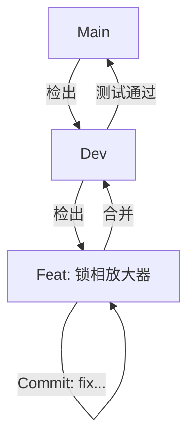

# 项目架构与 Git 工作规范

本文档旨在为当前项目（Docling PDF处理 + AI知识库 + 仪器控制）制定清晰的架构规划与 Git 协作规范。

## 1. 项目架构建议

### 1.1 核心决策：单体仓库 (Monorepo)

针对你的需求——**“PDF处理 -> 知识库构建 -> 仪器控制（SMB100A + 锁相放大器） -> 联合调试”**，最合适的架构是 **单体仓库 (Monorepo)**。

**理由如下：**

1.  **AI 上下文统一**：AI Agent 需要同时访问“知识库”（了解如何写代码）和“实际运行环境”（执行代码）。如果分开两个项目，AI 需要在不同工作区切换，不仅麻烦，而且无法在编写控制代码时实时查阅知识库的源文件。
2.  **联合调试便利**：你的终极目标是“双设备联调”。如果锁相放大器和 SMB100A 是两个独立项目，编写一个同时控制两台设备的 Python 脚本会非常困难（涉及跨项目引用）。在同一个项目中，只需 `import drivers.smb100a` 和 `import drivers.lockin` 即可。
3.  **知识库迭代闭环**：当你发现 AI 写出的代码报错，往往意味着知识库（PDF解析结果）有误。在同一个项目中，你可以立刻修改解析脚本或补充文档，重新生成 KB，然后立即重试代码，形成完美的反馈闭环。

### 1.2 建议目录结构

建议将项目重构为以下模块化结构，清晰分离“数据生产（文档处理）”和“数据消费（仪器控制）”，并严格隔离不同状态的数据：

```text
project-root/
├── .agent/                 # Agent 专属配置与技能
│   ├── skills/             # SMB100A, Lock-in 等技能定义
│   └── workflows/          # 自动化 Git 工作流
├── references/             # [新增] 外部参考资料 (从 scpiexpert01 迁移)
│   └── Rohde-Schwarz/      # 官方 GitHub 例程 (作为 AI 编程的"标准答案"参考)
├── docling_pipeline/       # [模块1] 知识库生产线 (文档处理)
│   ├── input/              # 原始 PDF 数据源
│   ├── scripts/            # Docling 转换与清洗脚本
│   └── config/             # 提取配置 (OCR, Table Structure)
├── knowledge_base/         # [模块2] 生产级核心知识库 (Clean, Git-Tracked)
│   ├── v1.0/               # 版本化管理，确保 AI 引用稳定
│   │   ├── smb100a/        # 命名空间严格隔离，防止指令混淆
│   │   └── lockin_amp/
│   └── latest -> v1.0      # 软链接指向当前激活版本
├── experimental_data/      # [新增] 实验过程数据 (Dirty, Git-Ignored)
│   ├── logs/               # 运行日志
│   ├── raw_captures/       # 仪器返回的原始波形/数据
│   └── scratchpad/         # AI 的临时测试代码
├── instrument_control/     # [模块3] AI 编写的控制代码
│   ├── drivers/            # 封装好的底层驱动
│   └── experiments/        # 具体的实验脚本
├── docs/                   # 项目文档
└── README.md
```

### 1.3 知识库与数据隔离策略 (针对 User 反馈)

1.  **知识库 (In Git)**: `knowledge_base/` 目录存放经过**清洗、验证**的标准知识（AI 的“长期记忆”）。
    *   **多版本共存**：使用 `v1.0`, `v1.1` 目录结构或 Git Tag 管理。AI 默认读取 `latest` 指向的版本。若新版 PDF 解析效果不佳，可立即把 `latest` 指回旧版，无需回滚代码。
    *   **设备隔离**：不同设备必须在不同子目录（`smb_100a/` vs `lockin/`）。Agent Skill 配置将分别锁定特定目录，从物理上防止 AI 把 SMB100A 的指令发给锁相放大器。

2.  **实验数据 (Not in Git)**: `experimental_data/` 用于存放大量的运行日志和采集数据。
    *   **策略**：此目录应加入 `.gitignore`。
    *   **理由**：避免实验产生的 G/T 级数据污染代码仓库，同时防止 AI 将“某次实验的错误日志”误当成“正确知识”学习。

3.  **外部参考 (Migration)**: 将 `scpiexpert01` 中的官方例程迁移至 `references/`。这些代码是“黄金标准”，当 AI 困惑时，可通过 `search` 技能查阅此处代码，而不是完全依赖自己生成的 KB。

---

## 2. Git 工作流规范

基于你提供的参考文档，结合当前单人/AI协作的特点，推荐采用 **简化版 Git Flow**。

### 2.1 分支管理

*   **`main` (主分支)**: 永远保持稳定，随时可运行。仅接受来自 `dev` 的合并。
*   **`dev` (开发分支)**: 日常开发的主干。所有的功能开发完成后合并到此。
*   **`feat/<name>` (功能分支)**: 开发具体新功能（如“添加锁相放大器支持”）。从 `dev` 检出，完成后合并回 `dev`。
*   **`docs/<name>` (文档分支)**: 专门用于处理文档、知识库更新。

### 2.2 提交信息规范 (Conventional Commits)

必须遵循标准格式：`<类型>(<范围>): <描述>`

*   **feat**: 新功能 (e.g., `feat(lockin): add basic connect script`)
*   **fix**: 修复 Bug (e.g., `fix(parser): resolve pdf table extraction error`)
*   **docs**: 文档/知识库变更 (e.g., `docs(kb): update smb100a command list`)
*   **style**: 格式调整，不影响代码逻辑
*   **refactor**: 代码重构
*   **chore**: 构建过程或辅助工具的变动

### 2.3 工作流程图



---

## 3. 自动化实现 (Workflows)

为了方便执行上述规范，我已在 `.agent/workflows/` 下为你创建了以下自动化工作流：

1.  **`start_feature.md`**: 自动从 dev 创建新分支，规范命名。
2.  **`git_commit.md`**: 智能分析修改内容，自动生成符合规范的 Commit Message 并提交。
3.  **`finish_feature.md`**: 完成当前工作，合并回 dev 并删除临时分支。

你只需要在对话中告诉 AI：“开始开发锁相放大器功能”或“提交代码”，AI 就会自动调用这些标准流程。
